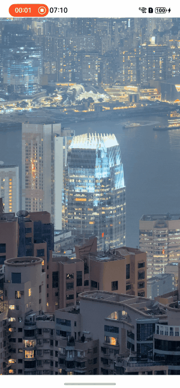
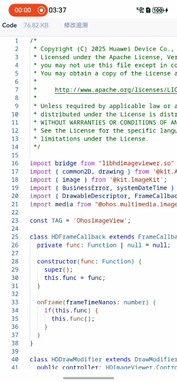

# hd_image_viewer

专门为OpenHarmony打造用于显示大图、长图、超大图（*.jpg,*.png）的组件，根据分辨率和缩放大小来动态控制图片的采样率，进行自适应分块渲染，在不超过应用内存水位的情况下能够展示原图。

## 功能简介

本项目参考开源库[subsampling-scale-image-view](https://github.com/davemorrissey/subsampling-scale-image-view)进行OpenHarmony的自研版本：

- 支持超大图的降采样，区域解码与分块加载，减少应用内存开销；

- 支持预览图显示；

- 支持图片放大/缩小操作，同时支持缩放手势、双击手势的控制；允许指定图片缩放倍数阈值；

- 支持图片平移操作，同时支持平移手势的控制；

- 支持图片旋转操作，同时支持获取资源文件中EXIF字段并自动旋转；

- 支持动画操作；

- 支持获取图片资源属性，支持获取图片当前显示状态，支持接收图片加载状态，显示状态变化事件回调；

- 支持调试模式；

  #### 双击放大效果（超大图）

  

  图片来源：https://commons.wikimedia.org/wiki/File:Panorama_of_Hong_Kong_Harbour_from_The_Peak_dllu.jpg

  #### 双指缩放效果（超大图）

  

  图片来源：https://commons.wikimedia.org/wiki/File:Panorama_of_Hong_Kong_Harbour_from_The_Peak_dllu.jpg
  
  #### 平移效果（长图）
  
  

## 下载安装
ohpm install hdimageviewer

## 约束与限制
**代码依赖鸿蒙API18提供的图片区域解码能力**

在下述版本验证通过：  
DevEco Studio: DevEco Studio 5.1.0 Release, SDK: API Version 18 Release(5.1.0.110)


## 使用说明

1. git安装lfs插件后再拉取代码

2. 使用Dev Eco（版本应 >= 5.0.1 Release）打开文件夹

3. hdimageviewer目录下即是组件核心代码；entry\src\m ain\ets\pages目录下为组件使用案例

   **显示大图以及预览图示例：**

   ```ts
   import { HDImageViewer } from 'hdimageviewer';
   
   @Entry
   @Component
   struct HDImageViewerImage {
   @State srcInfo: HDImageViewer.ImageResourceInfo = {
     src: $r("app.media.swissroad"),
     previewSrc: $r("app.media.swissroad_thumbnail")
   };
   private controller: HDImageViewer.Controller = new HDImageViewer.Controller();
     async aboutToAppear() {
   	// Other settings
   	this.controller.setOrientation(HDImageViewer.Orientation.ORIENTATION_90);
     }
       build() {
           HDImageViewer({ srcInfo: this.srcInfo, controller: this.controller })
           .width('100%')
           .height('100%')
       }
   }
   ```

## 使用说明

参考HDImageViewer.ets的演示页面进行使用hd_image_viewer组件
#### 1.创建一个加载大图的组件
```ts
import { HDImageViewer } from "hdimageviewer"

@Component
struct HDImageViewerImage {
  @State srcInfo: HDImageViewer.ImageResourceInfo = {src: $r("app.media.swissroad"))};
  
  build() {
    Flex() {
      HDImageViewer({
        srcInfo: this.srcInfo
      }).width('100%').height('100%')
    }
  }
}
```

#### 2.创建一个加载预览图和大图的组件
```ts
import { HDImageViewer } from "hdimageviewer"

@Component
struct HDImageViewerImage {
  @State srcInfo: HDImageViewer.ImageResourceInfo = {
    src: $r("app.media.swissroad"),
    previewSrc: $r("app.media.swissroad_thumbnail")
  };
  
  build() {
    Flex() {
      HDImageViewer({
        srcInfo: this.srcInfo
      }).width('100%').height('100%')
    }
  }
}
```

#### 3.支持大图组件中更新显示图片
```ts
import { HDImageViewer } from "hdimageviewer"

@Component
struct HDImageViewerImage {
  @State srcInfo: HDImageViewer.ImageResourceInfo = {
    src: $r("app.media.swissroad"),
    previewSrc: $r("app.media.swissroad_thumbnail")
  };
  
  build() {
    Flex() {
      HDImageViewer({
        srcInfo: this.srcInfo
      }).width('100%').height('100%')

      Button("replace image").onClick((event?: ClickEvent) => {
        this.srcInfo = {src: $r("app.media.card")};
      })
    }
  }
}
```
#### 4.支持设置大图组件中图片的最小(或最大)缩放比率
```
import { HDImageViewer } from "hdimageviewer"

@Component
struct HDImageViewerImage {
  private controller: HDImageViewer.Controller = new HDImageViewer.Controller()
  @State srcInfo: HDImageViewer.ImageResourceInfo = {src: $r("app.media.swissroad")};
  
  async aboutToAppear() {
    this.controller.setMinScale(1);
  }
  
  build() {
    Flex() {
      HDImageViewer({
        srcInfo: this.srcInfo,
        controller: this.controller
      }).width('100%').height('100%')
    }
  }
}
```

## 接口说明

### HDImageViewer组件参数列表

| 名称         | 类型                              | 必填 | 说明                                              |
|------------|---------------------------------| ---- |-------------------------------------------------|
| srcInfo    | HDImageViewer.ImageResourceInfo | 是   | 图片资源，包含大图和配套的预览图，两者作为一个整体设置。预览图用于在大图解码过程中显示防止黑屏 |
| controller | HDImageViewer.Controller        | 否   | 组件管理对象                                          |


**示例：**

```ts
import { HDImageViewer } from 'hdimageviewer';

@State srcInfo: HDImageViewer.ImageResourceInfo = {
  src: $r("app.media.swissroad"),
  previewSrc: $r("app.media.swissroad_thumbnail")
};
private controller: HDImageViewer.Controller = new HDImageViewer.Controller();

build() {
  Flex() {
	HDImageViewer({ srcInfo: this.srcInfo, controller: this.controller })
  }
}
```
### HDImageViewer.ImageResourceInfo

设置大图组件图片资源的数据类。

| 参数名      | 类型                                                  | 必填   | 说明          |
|------------|------------------------------------------------------|-------|--------------|
| src        | PixelMap \| Resource \| String \| DrawableDescriptor | 是     | 大图的图片资源  |
| previewSrc | PixelMap \| Resource \| String                       | 否     | 预览图的图片资源 |


### HDImageViewer.Controller

组件管理类，用于控制组件的显示状态。应用可以创建一个HDImageViewer.Controller对象，在HDImageViewer组件初始化时作为入参传入，后续通过HDImageViewer.Controller对象来控制组件的显示状态。

##### setDebug

setDebug(debug: boolean): void

设置组件处于调试模式。调试模式开启时会打印调试日志，以及绘制tile的边界。

**参数：**

| 参数名 | 类型    | 必填 | 说明                             |
| ------ | ------- | ---- | -------------------------------- |
| debug  | boolean | 是   | 调试模式开关。默认关闭调试模式。 |

**示例：**

```ts
this.controller.setDebug(true);
```

##### isDebug

isDebug(): boolean

获取当前调试模式开关。

**返回值：**

| 类型    | 说明             |
| ------- | ---------------- |
| boolean | 当前调试模式开关 |

**示例：**

```ts
let isDebug = this.controller.isDebug();
```

##### onDraw

onDraw(context: DrawContext):void

负责组件的绘制接口。系统会自动触发该接口调用，使用侧不需要主动调用该接口。

**参数：**

| 参数名  | 类型        | 必填 | 说明        |
| ------- | ----------- | ---- | ----------- |
| context | DrawContext | 是   | DrawContext |

##### setView

setView(width: number, height: number): void

设置组件的宽高。系统会自动触发该接口调用，使用侧不需要主动调用该接口。

**参数：**

| 参数名 | 类型   | 必填 | 说明           |
| ------ | ------ | ---- | -------------- |
| width  | number | 是   | 组件宽，单位px |
| height | number | 是   | 组件高，单位px |

**示例：**

```ts
this.controller.setView(vp2px(width), vp2px(height));
```

##### setImage

setImage(src: PixelMap | ResourceStr | DrawableDescriptor, previewSource?: PixelMap | ResourceStr): void

设置图片。

**参数：**

| 参数名           | 类型                                            | 必填 | 说明 |
|---------------|-----------------------------------------------| ---- |----|
| src           | PixelMap \| ResourceStr \| DrawableDescriptor | 是   | 图片 |
| previewSource | PixelMap \| ResourceStr                       | 否  | 预览图 |

**示例：**

```ts
this.controller.setImage('/data/storage/el2/base/cache/map.jpg');
this.controller.setImage('/data/storage/el2/base/cache/map.jpg', '/data/storage/el2/base/cache/map_preview.jpg');

##### setScaleAndCenter

setScaleAndCenter(scale: number, center: common2D.Point): void

设置图片的缩放倍数，以及视图中心的原图坐标。最终显示效果受到组件PanLimit类型限制。

**参数：**

| 参数名 | 类型           | 必填 | 说明                     |
| ------ | -------------- | ---- | ------------------------ |
| scale  | number         | 是   | 缩放倍数                 |
| center | common2D.Point | 是   | 视图中心所对应的原图坐标 |

**示例：**

​```ts
let scale = 1;
let center: common2D.Point = {x: 100, y: 100};
this.controller.setScaleAndCenter(scale, center);
```

##### resetScaleAndCenter

resetScaleAndCenter(): void

重置图片的显示状态到初始状态。初始状态下，在缩放倍数的阈值内尽可能更多地显示图片内容。

**示例：**

```ts
this.controller.resetScaleAndCenter();
```

##### getScale

getScale(): number

获取图片当前缩放倍数

**返回值：**

| 类型   | 说明             |
| ------ | ---------------- |
| number | 当前图片缩放倍数 |

**示例：**

```ts
let scale = this.controller.getScale()
```

##### getCenter

getCenter(): common2D.Point

获取当前视图中心所对应的原图坐标

**返回值：**

| 类型           | 说明                         |
| -------------- | ---------------------------- |
| common2D.Point | 当前视图中心所对应的原图坐标 |

**示例：**

```ts
let centerNow = this.controller.getCenter();
```

##### getPanRemaining

getPanRemaining(): common2D.Rect

获取图片还能向4个方向挪动的距离。

**返回值：**

| 类型          | 说明                        |
| ------------- | --------------------------- |
| common2D.Rect | 图片还能向4个方向挪动的距离 |

**示例：**

```ts
let rect:common2D.Rect = this.controller.getPanRemaining();
```

##### getSrcWidth

getSrcWidth(): number

获取原图的宽。

**返回值：**

| 类型   | 说明     |
| ------ | -------- |
| number | 原图的宽 |

**示例：**

```ts
let srcWidth = this.controller.getSrcWidth();
```

##### getSrcHeight

getSrcHeight(): number

获取原图的高。

**返回值：**

| 类型   | 说明     |
| ------ | -------- |
| number | 原图的高 |

**示例：**

```ts
let srcHeight = this.controller.getSrcHeight();
```

##### isPanEnable

isPanEnable(): boolean

当前是否响应手势拖动事件

**返回值：**

| 类型    | 说明                     |
| ------- | ------------------------ |
| boolean | 当前是否响应手势拖动事件 |

**示例：**

```ts
let enable = this.controller.isPanEnable();
```

##### setPanEnable

setPanEnable(enable: boolean):void

设置是否响应手势拖动事件

**参数：**

| 参数名 | 类型    | 必填 | 说明                                       |
| ------ | ------- | ---- | ------------------------------------------ |
| enable | boolean | 是   | 是否响应手势拖动事件；默认响应手势拖动事件 |

**示例：**

```ts
this.controller.setPanEnable(true);
```

##### setPanLimit

setPanLimit(type: PanLimit): boolean

设置图片允许移动的区域类型

**参数：**

| 参数名 | 类型     | 必填 | 说明                                            |
| ------ | -------- | ---- | ----------------------------------------------- |
| type   | PanLimit | 是   | 图片允许移动的区域类型；默认值为PanLimit.INSIDE |

**返回值：**

| 类型    | 说明         |
| ------- | ------------ |
| boolean | 设置是否成功 |

**示例：**

```ts
boolean ret = this.controller.setPanLimit(PanLimit.INSIDE);
```

##### pan

pan(distanceX: number, distanceY: number): void

设置图片平移，组件接收到平移事件时的默认响应函数。最终显示效果受到组件PanLimit类型限制。

**参数：**

| 参数名    | 类型   | 必填 | 说明                    |
| --------- | ------ | ---- | ----------------------- |
| distanceX | number | 是   | x轴方向平移距离，单位px |
| distanceY | number | 是   | y轴方向平移距离，单位px |

**示例：**

```ts
this.controller.pan(vp2px(event.offsetX), vp2px(event.offsetY);
```

##### isZoomEnabled

isZoomEnabled(): boolean

是否允许缩放

**返回值：**

| 类型    | 说明         |
| ------- | ------------ |
| boolean | 是否允许缩放 |

**示例：**

```ts
let enable = this.controller.isZoomEnabled();
```

##### setZoomEnabled

setZoomEnabled(enable: boolean): void

设置允许图片缩放

**参数：**

| 参数名 | 类型    | 必填 | 说明                                       |
| ------ | ------- | ---- | ------------------------------------------ |
| enable | boolean | 是   | 是否允许图片进行缩放；默认允许图片进行缩放 |

**示例：**

```ts
this.controller.setZoomEnabled(true);
```

##### pinch

pinch(scale: number, centerX: number, centerY: number): void

设置图片缩放倍数 。组件接收到缩放手势时的默认响应函数。最终显示效果受到组件PanLimit类型以及缩放阈值限制。

**参数：**

| 参数名  | 类型   | 必填 | 说明                                         |
| ------- | ------ | ---- | -------------------------------------------- |
| scale   | number | 是   | 在当前组件的缩放倍数基础上，再进行缩放的倍数 |
| centerX | number | 是   | 缩放中心点在屏幕上的x坐标，单位px            |
| centerY | number | 是   | 缩放中心点在屏幕上的y坐标，单位px            |

**示例：**

```ts
this.controller.pinch(scale, vp2px(event.pinchCenterX), vp2px(event.pinchCenterY));
```

##### scalePlayBack

scalePlayBack(centerX: number, centerY: number): void

当前scale超出设置的scale阈值时，设置scale回滚到阈值范围内，该过程使用默认动画效果。

**参数：**

| 参数名  | 类型   | 必填 | 说明                              |
| ------- | ------ | ---- | --------------------------------- |
| centerX | number | 是   | 缩放中心点在组件上的x坐标，单位px |
| centerY | number | 是   | 缩放中心点在组件上的y坐标，单位px |

**示例：**

```ts
this.controller.scalePlayBack(vp2px(event.pinchCenterX),vp2px(event.pinchCenterY));
```

##### doubleClickZoom

doubleClickZoom(localX: number, localY: number):void

双击事件响应函数。

当前缩放倍数小于 0.9 maxscale时，以点击坐标为中心进行放大至maxscale；当前缩放倍数大于0.9 maxscale时，以点击坐标为中心进行缩小至minscale。最终显示效果受到组件PanLimit类型限制。

**参数：**

| 参数名 | 类型   | 必填 | 说明          |
| ------ | ------ | ---- | ------------- |
| localX | number | 是   | x坐标，单位px |
| localY | number | 是   | y坐标，单位px |

**示例：**

```ts
this.controller.doubleClickZoom(vp2px(fingerInfo[0].localX), vp2px(fingerInfo[0].localY));
```

##### getMaxScale

getMaxScale(): number

获取当前设置的最大缩放倍数。

**返回值：**

| 类型   | 说明         |
| ------ | ------------ |
| number | 最大缩放倍数 |

**示例：**

```ts
let scale = this.controller.getMaxScale();
```

##### setMaxScale

setMaxScale(scale: number): void

设置图片的最大缩放倍数

**参数：**

| 参数名 | 类型   | 必填 | 说明                    |
| ------ | ------ | ---- | ----------------------- |
| scale  | number | 是   | 最大缩放倍数；默认值为4 |

**示例：**

```ts
let scale = 1;
this.controller.setMaxScale(scale);
```

##### getMinScale

getMinScale(): number

获取当前设置的最小缩放倍数。

**返回值：**

| 类型   | 说明         |
| ------ | ------------ |
| number | 最小缩放倍数 |

**示例：**

```ts
let scale = this.controller.getMinScale();
```

##### setMinScale

setMinScale(scale: number): void

设置图片的最小缩放倍数

**参数：**

| 参数名 | 类型   | 必填 | 说明                       |
| ------ | ------ | ---- | -------------------------- |
| scale  | number | 是   | 最小缩放倍数；默认值为0.01 |

**示例：**

```ts
let scale = 1;
this.controller.setMinScale(scale);
```

##### setMaximumDpi

setMaximumDpi(dpi: number): void

设置图片显示的最大DPI

**参数：**

| 参数名 | 类型   | 必填 | 说明              |
| ------ | ------ | ---- | ----------------- |
| dpi    | number | 是   | 图片显示的最大DPI |

**示例：**

```ts
let dpi = 100;
this.controller.setMaximumDpi(dpi);
```

##### setMinimumDpi

setMinimumDpi(dpi: number): void

设置图片显示的最小DPI

**参数：**

| 参数名 | 类型   | 必填 | 说明              |
| ------ | ------ | ---- | ----------------- |
| dpi    | number | 是   | 图片显示的最小DPI |

**示例：**

```ts
let dpi = 100;
this.controller.setMinimumDpi(dpi);
```

##### isDoubleClickEnabled

isDoubleClickEnabled(): boolean

当前是否允许双击缩放事件

**返回值：**

| 类型    | 说明                     |
| ------- | ------------------------ |
| boolean | 当前是否允许双击缩放事件 |

**示例：**

```ts
let enable = this.controller.isDoubleClickEnabled();
```

##### setDoubleClickEnabled

setDoubleClickEnabled(enable: boolean): void

设置允许图片双击缩放。该功能同时还受到isZoomEnabled控制。

**参数：**

| 参数名 | 类型    | 必填 | 说明                                             |
| ------ | ------- | ---- | ------------------------------------------------ |
| enable | boolean | 是   | 允许图片进行双击缩放；默认允许图片进行双击缩放； |

**示例：**

```ts
this.controller.setDoubleClickEnabled(true);
```

##### setDoubleTapZoomAnimEnabled

setDoubleTapZoomAnimEnabled(enabled: boolean): void

设置双击缩放事件时是否使用动画

**参数：**

| 参数名  | 类型    | 必填 | 说明                                     |
| ------- | ------- | ---- | ---------------------------------------- |
| enabled | boolean | 是   | 双击缩放事件时是否使用动画；默认启动动画 |

**示例：**

```ts
this.controller.setDoubleTapZoomAnimEnabled(true);
```

##### setDoubleTapZoomScale

setDoubleTapZoomScale(scale: number): void

设置图片双击放大后的默认缩放倍数，该值实际效果受到缩放倍数阈值的限制。

**参数：**

| 参数名 | 类型   | 必填 | 说明                                      |
| ------ | ------ | ---- | ----------------------------------------- |
| scale  | number | 是   | 图片双击放大后的默认缩放倍数；默认值为1； |

**示例：**

```ts
let scale = 1;
this.controller.setDoubleTapZoomScale(scale);
```

##### setDoubleTapZoomDpi

setDoubleTapZoomDpi(dpi: number): void

设置图片双击放大后的默认缩放DPI，该值实际效果受到缩放倍数阈值的限制。

**参数：**

| 参数名 | 类型   | 必填 | 说明                    |
| ------ | ------ | ---- | ----------------------- |
| dpi    | number | 是   | 图片双击放大后的默认dpi |

**示例：**

```ts
let dpi = 100;
this.controller.setDoubleTapZoomDpi(dpi);
```

##### setDoubleTapZoomDuration

setDoubleTapZoomDuration(duration: number): void

设置图片双击缩放时的动画时长

**参数：**

| 参数名   | 类型   | 必填 | 说明                             |
| -------- | ------ | ---- | -------------------------------- |
| duration | number | 是   | 动画时长，单位ms；默认值为1000ms |

**示例：**

```ts
let duration = 100;
this.controller.setDoubleTapZoomDuration(duration);
```

##### setStateChangedListener

setStateChangedListener(stateChangedListener: StateChangedListener | null): void

设置图片显示状态变化监听对象。

**参数：**

| 参数名               | 类型                         | 必填 | 说明                                                 |
| -------------------- | ---------------------------- | ---- | ---------------------------------------------------- |
| stateChangedListener | StateChangedListener \| null | 是   | 图片显示状态变化监听对象，当参数为null时为取消监听。 |

**示例：**

```ts
class CustomOnStateChangedListener extends StateChangedListener {
  onScaleChanged(scale: number){
    prompt.showToast({
      message: "ScaleChanged scale:" + scale,
      duration: 1000
    })
  }
  onCenterChanged(point: common2D.Point){
    prompt.showToast({
      message: "CenterChanged point:( " + point.x + ", " + point.y + " )",
      duration: 1000
    })
  }
}
let stateChangedListener: StateChangedListener = new CustomOnStateChangedListener();
this.controller.setStateChangedListener(stateChangedListener)
```

##### setImageEventListener

setImageEventListener(imageEventListener: ImageEventListener | null): void

设置图片加载状态变化监听对象。

**参数：**

| 参数名             | 类型                      | 必填 | 说明                                                 |
| ------------------ | ------------------------- | ---- | ---------------------------------------------------- |
| imageEventListener | ImageEventListener\| null | 是   | 图片加载状态变化监听对象，当参数为null时为取消监听。 |

**示例：**

```ts
class CustomOnImageEventListener extends ImageEventListener {
  onImageLoaded(){
    console.debug(TAG, "subsampling image load success")
  }
  onImageLoadError(){
    console.debug(TAG, "subsampling image load error")
  }
  onPreviewImageReady(){
    console.debug(TAG, "preview image load success")
  }
  onPreviewImageReleased(){
    console.debug(TAG, "preview image release success")
  }
  onPreviewImageLoadError(){
    console.debug(TAG, "preview image load error")
  }
}
let onImageEventListener: ImageEventListener = new CustomOnImageEventListener();
this.controller.setImageEventListener(onImageEventListener)
```

##### hasImage

hasImage(): boolean

组件是否设置过原图。

**返回值：**

| 类型    | 说明               |
| ------- | ------------------ |
| boolean | 组件是否设置过原图 |

**示例：**

```ts
let hasImage = this.controller.hasImage();
```

##### isReady

isReady(): boolean

原图是否已经准备显示了

**返回值：**

| 类型    | 说明                   |
| ------- | ---------------------- |
| boolean | 原图是否已经准备显示了 |

**示例：**

```ts
let ready = this.controller.isReady();
```

##### isImageLoaded

isImageLoaded(): boolean

原图是否已加载

**返回值：**

| 类型    | 说明           |
| ------- | -------------- |
| boolean | 原图是否已加载 |

**示例：**

```ts
let load = this.controller.isImageLoaded();
```

##### setOrientation

setOrientation(type: Orientation): boolean

设置图片显示旋转角度

**参数：**

| 参数名 | 类型        | 必填 | 说明                                                         |
| ------ | ----------- | ---- | ------------------------------------------------------------ |
| type   | Orientation | 是   | 图片显示的旋转角度；默认值为Orientation.ORIENTATION_UES_EXIF； |

**返回值：**

| 类型    | 说明         |
| ------- | ------------ |
| boolean | 设置是否成功 |

**示例：**

```ts
boolean ret = this.controller.setOrientation(Orientation.ORIENTATION_UES_EXIF);
```

##### getOrientation

getOrientation(): Orientation

获取当前设置的旋转角度

**返回值：**

| 类型        | 说明               |
| ----------- | ------------------ |
| Orientation | 当前设置的旋转角度 |

**示例：**

```ts
let orientation = this.controller.getOrientation();
```

##### getAppliedOrientation

getAppliedOrientation(): Orientation

获取当前图片实际的旋转角度

**返回值：**

| 类型        | 说明                   |
| ----------- | ---------------------- |
| Orientation | 当前图片实际的旋转角度 |

**示例：**

```ts
let orientation = this.controller.getAppliedOrientation();
```

##### newAnimBuilder

newAnimBuilder(): AnimBuilder

构造一个动画实例，可以通过这个动画实例实现动画效果

**返回值：**

| 类型        | 说明     |
| ----------- | -------- |
| AnimBuilder | 动画实例 |

**示例：**

```ts
let anim = this.controller.newAnimBuilder();
let centerNow = this.controller.getCenter();
let centerEnd: common2D.Point = {x: 100, y: 100 }
anim.setCenter(centerEnd);
anim.setEasing(Ease.OUT_QUAD);
anim.start();
```

##### setTileBackgroundColor

setTileBackgroundColor(color: common2D.Color): void

设置组件背景颜色

**参数：**

| 参数名 | 类型           | 必填 | 说明                     |
| ------ | -------------- | ---- | ------------------------ |
| color  | common2D.Color | 是   | 组件背景颜色；默认为透明 |

**示例：**

```ts
let color: common2D.Color = { alpha: 0, red: 0, green: 0, blue: 0};
this.controller.setTileBackgroundColor(color);
```

##### setEagerLoadingEnabled

setEagerLoadingEnabled(eagerLoadingEnabled: boolean): void

组件在拖动时是否允许解码

**参数：**

| 参数名              | 类型    | 必填 | 说明                                                         |
| ------------------- | ------- | ---- | ------------------------------------------------------------ |
| eagerLoadingEnabled | boolean | 是   | 在拖动时允许解码。值为true时：任何时刻都可以触发解码任务；值为false时：手指拖动过程中不允许触发新的解码任务，等手抬起时根据当前可视区域进行解码；默认值为true； |

**示例：**

```ts
this.controller.setEagerLoadingEnabled(true);
```

##### recycle

recycle(): void

释放当前组件所有资源，包括原图，预览图，以及所有缓存的资源。

**示例：**

```ts
this.controller.recycle();
```

##### viewToSrcCoord

viewToSrcCoord(point: common2D.Point): common2D.Point

获取组件上指定位置对应的原图坐标

**参数：**

| 参数名 | 类型           | 必填 | 说明         |
| ------ | -------------- | ---- | ------------ |
| type   | common2D.Point | 是   | 组件上的坐标 |

**返回值：**

| 类型           | 说明     |
| -------------- | -------- |
| common2D.Point | 原图坐标 |

**示例：**

```ts
let vPoint: common2D.Point = {x: 100, y: 100};
let srcPoint = this.controller.viewToSrcCoord(vPoint);
```

##### srcToViewCoord

srcToViewCoord(point: common2D.Point): common2D.Point

获取原图指定位置在组件上显示坐标

**参数：**

| 参数名 | 类型           | 必填 | 说明             |
| ------ | -------------- | ---- | ---------------- |
| type   | common2D.Point | 是   | 原图指定位置坐标 |

**返回值：**

| 类型           | 说明         |
| -------------- | ------------ |
| common2D.Point | 组件上的坐标 |

**示例：**

```ts
let srcPoint: common2D.Point = {x: 100, y: 100};
let vPoint = this.controller.srcToViewCoord(srcPoint);
```

##### getVisibleSrcRect

getVisibleSrcRect(): common2D.Rect

获取原图当前的可视区域

**返回值：**

| 类型          | 说明               |
| ------------- | ------------------ |
| common2D.Rect | 原图当前的可视区域 |

**示例：**

```ts
let rect = this.controller.getVisibleSrcRect();
```

### HDImageViewer.StateChangedListener

用于监听图片显示状态变化，可参考HDImageViewer.Controller.setStateChangedListener。

##### onScaleChanged

onScaleChanged(newScale: number): void

响应图片缩放倍数变化事件

**参数：**

| 参数名   | 类型   | 必填 | 说明         |
| -------- | ------ | ---- | ------------ |
| newScale | number | 是   | 当前缩放倍数 |

##### onCenterChanged

onCenterChanged(center: common2D.Point): void

响应图片显示中心变化事件

**参数：**

| 参数名 | 类型           | 必填 | 说明                       |
| ------ | -------------- | ---- | -------------------------- |
| center | common2D.Point | 是   | 当前组件中心对应的原图坐标 |

**示例：**

```ts
class CustomOnStateChangedListener extends HDImageViewer.StateChangedListener {
  onScaleChanged(scale: number){
    prompt.showToast({
      message: "ScaleChanged scale:" + scale,
      duration: 1000
    })
  }
  onCenterChanged(point: common2D.Point){
    prompt.showToast({
      message: "CenterChanged point:( " + point.x + ", " + point.y + " )",
      duration: 1000
    })
  }
}
let stateChangedListener: StateChangedListener = new CustomOnStateChangedListener();
this.controller.setStateChangedListener(stateChangedListener)
```

### HDImageViewer.ImageEventListener

用于监听图片加载状态变化，可参考HDImageViewer.Controller.setImageEventListener。

##### onImageReady

onImageReady(): void

响应原图准备完成事件

##### onImageLoaded

onImageLoaded(): void

响应原图加载完成事件

##### onImageLoadError

onImageLoadError(error: string): void

响应原图加载错误事件

**参数：**

| 参数名 | 类型   | 必填 | 说明         |
| ------ | ------ | ---- | ------------ |
| error  | string | 是   | 详细错误信息 |

##### onTileLoadError

onTileLoadError(error: string): void

响应原图分块解码错误事件

**参数：**

| 参数名 | 类型   | 必填 | 说明         |
| ------ | ------ | ---- | ------------ |
| error  | string | 是   | 详细错误信息 |

##### onPreviewImageReady

onPreviewImageReady(): void

响应预览图准备完成事件

##### onPreviewImageReleased

onPreviewImageReleased(): void

响应预览图资源已释放事件。在原图加载完成后立即释放预览图资源。

##### onPreviewImageLoadError

onPreviewImageLoadError(error: string): void

响应预览图资源加载出错事件

**参数：**

| 参数名 | 类型   | 必填 | 说明         |
| ------ | ------ | ---- | ------------ |
| error  | string | 是   | 详细错误信息 |

**示例：**

```ts
const TAG = 'HDImageViewerImage';
class CustomOnImageEventListener extends HDImageViewer.ImageEventListener {
  onImageReady() {
    console.debug(TAG, "onImageReady");
  }
  onImageLoaded() {
    console.debug(TAG, "onImageLoaded");
  }
  onImageLoadError(error: string) {
    console.debug(TAG, "onImageLoadError: " + error);
  }
  onTileLoadError(error: string) {
    console.debug(TAG, "onTileLoadError: " + error);
  }
  onPreviewImageReady() {
    console.debug(TAG, "onPreviewImageReady")
  }
  onPreviewImageReleased() {
    console.debug(TAG, "onPreviewImageReleased")
  }
  onPreviewImageLoadError(error: string) {
    console.debug(TAG, "onPreviewImageLoadError: " + error);
  }
}
let onImageEventListener: HDImageViewer.ImageEventListener = new CustomOnImageEventListener();
this.controller.setImageEventListener(onImageEventListener)
```

### HDImageViewer.PanLimit

限制图片移动范围的枚举，可以通过HDImageViewer.Controller.setPanLimit接口设置。

| 名称    | 值   | 说明                                                         |
| ------- | ---- | ------------------------------------------------------------ |
| INSIDE  | 0    | 不让图像平移到屏幕外，尽可能更多地显示图像；当图像较小时，在视图居中 |
| OUTSIDE | 1    | 允许让图像刚好平移到屏幕外                                   |
| CENTER  | 2    | 允许让图像的一个角平移到视图中间                             |

### HDImageViewer.Orientation

图像的旋转角度

| 名称                      | 值 | 说明                                    |
|--------------------------|---|---------------------------------------|
| ORIENTATION_0            | 0 | 不旋转                                   |
| ORIENTATION_90           | 1 | 顺时针90度                                |
| ORIENTATION_180          | 2 | 顺时针180度                               |
| ORIENTATION_270          | 3 | 顺时针270度                               |
| ORIENTATION_FLIP_H       | 4 | 水平镜像翻转                                |
| ORIENTATION_FLIP_V       | 5 | 垂直镜像翻转                                |
| ORIENTATION_FLIP_H_270   | 6 | 水平镜像翻转后顺时针270度                        |
| ORIENTATION_FLIP_H_90    | 7 | 水平镜像翻转后顺时针90度                         |
| ORIENTATION_UES_EXIF     | 8 | 根据文件中EXIF保存的角度来旋转，如果文件不包含EXIF字段，则不做旋转 |

### HDImageViewer.AnimBuilder

用于控制动画效果，实例对象可以通过HDImageViewer.Controller.newAnimBuilder接口获取。

##### setScale

setScale(scale: number): void

设置动画的目标缩放倍数

**参数：**

| 参数名 | 类型   | 必填 | 说明                             |
| ------ | ------ | ---- | -------------------------------- |
| scale  | number | 是   | 目标缩放倍数；默认缩放倍数不变化 |

##### setCenter

setCenter(center: common2D.Point): void

设置原图的动画中心坐标，动画结束时会将原图的给定坐标移动至视图的给定位置

**参数：**

| 参数名 | 类型           | 必填 | 说明                                               |
| ------ | -------------- | ---- | -------------------------------------------------- |
| center | common2D.Point | 是   | 原图的坐标点；默认为当前视图中心所对应的原图坐标点 |

##### setFocus

setFocus(focus: common2D.Point): void

设置视图的动画中心目标，动画结束时会将原图的给定坐标移动至视图的给定位置

**参数：**

| 参数名 | 类型           | 必填 | 说明                               |
| ------ | -------------- | ---- | ---------------------------------- |
| focus  | common2D.Point | 是   | 视图的坐标点；默认为视图中心坐标点 |

##### setDuration

setDuration(duration: number): void

设置动画的时长。

**参数：**

| 参数名   | 类型   | 必填 | 说明                                |
| -------- | ------ | ---- | ----------------------------------- |
| duration | number | 是   | 动画时长，单位ms；默认动画时长500ms |

##### setInterruptable

setInterruptable(interruptable: boolean): void

设置动画是否可以被打断，如被用户手势、新的动画所打断。

**参数：**

| 参数名        | 类型    | 必填 | 说明                                 |
| ------------- | ------- | ---- | ------------------------------------ |
| interruptable | boolean | 是   | 动画是否可以被打断；默认动画可被打断 |

##### setEasing

setEasing(easing: number): void

设置动画的运动轨迹类型。

**参数：**

| 参数名 | 类型               | 必填 | 说明         |
| ------ | ------------------ | ---- | ------------ |
| easing | HDImageViewer.Ease | 是   | 运动轨迹类型 |

##### setEvenListener

setEvenListener(listener: AnimEventListener): void

设置动画的状态监听对象。

**参数：**

| 参数名   | 类型                            | 必填 | 说明               |
| -------- | ------------------------------- | ---- | ------------------ |
| listener | HDImageViewer.AnimEventListener | 是   | 动画的状态监听对象 |

##### start

start(): boolean

启动动画。

**返回值：**

| 类型    | 说明                                    |
| ------- | --------------------------------------- |
| boolean | true：动画正常启动；false：动画启动失败 |

**示例：**

```ts
let anim = this.controller.newAnimBuilder();
let centerNow = this.controller.getCenter();
let centerEnd: common2D.Point = {
    x: centerNow.x + 100,
    y: centerNow.y + 100
}
anim.setCenter(centerEnd);
anim.setEasing(HDImageViewer.Ease.OUT_QUAD);
anim.start();
```

### HDImageViewer.Ease

动画运动轨迹的类型。

| 名称        | 值   | 说明                       |
| ----------- | ---- | -------------------------- |
| IN_OUT_QUAD | 0    | 开始与结束比较慢，适合缩放 |
| OUT_QUAD    | 1    | 先快后慢，适合平移         |

### HDImageViewer.AnimEventListener

用于监听动画状态变化，可参考HDImageViewer.AnimBuilder.setEvenListener。

##### onComplete

onComplete(): void

动画执行完成。

##### onInterruptedByUser

onInterruptedByUser(): void

动画被用户手势事件打断

##### onInterruptedByNewAnim

onInterruptedByNewAnim(): void

动画被新的动画打断

##### onStartError

onStartError(error: string): void

动画启动失败。如果当前正在执行的动画为不可中断类型，则新的动画无法启动。

**参数：**

| 参数名 | 类型   | 必填 | 说明               |
| ------ | ------ | ---- | ------------------ |
| error  | string | 是   | 动画启动失败的原因 |

## Skia说明

Skia是一个跨平台2D图形库，用于绘制文本、几何图形、图像以及区域编解码。本项目主要用到了其中的区域编解码功能。

由于本项目需要在鸿蒙os上使用，需要适配ohos交叉编译工具链。详情请参考
[Skia库ohos工具链适配](https://gitcode.com/openharmony-sig/hd_image_viewer/blob/dev_120fps/third-party/skia-compile-guide.md)

## 开源协议

本项目基于 [Apache License 2.0](https://gitcode.com/openharmony-sig/hd_image_viewer/blob/dev_120fps/LICENSE) ，请自由的享受和参与开源。
